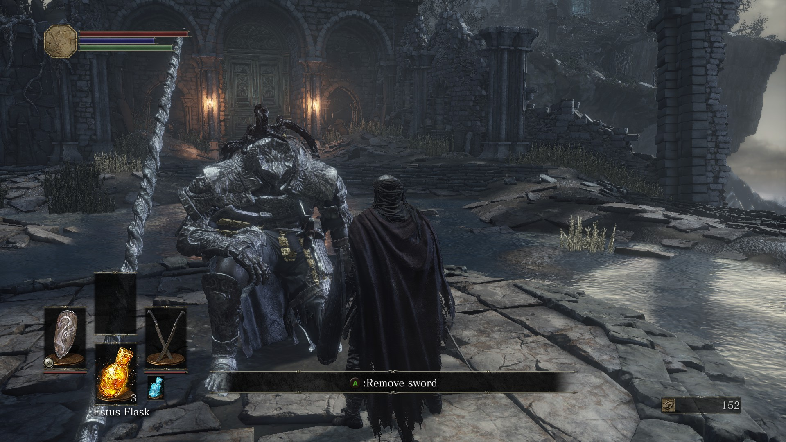

.. _start:

Starting the Game
===============

Before beginning your first playthrough of Dark Souls III there is some important information that the player should know.

1. This game is extremely difficult. You will fail. You will die. You will lose all your souls over and over. All of this is part of the challenge and part of the experience. Do not give up.
2. A controller, such as a Dualshock controller, an Xbox One controller, or a Nintendo Switch Pro controller, is not inherently required to play the game, but Dark Souls games are built primarily for consoles and thus are best played using a controller. If the user is on a PC, playing on mouse and keyboard is strongly discouraged as it will make the game much more difficult and frustrating.
3. Dark Souls III can be confusing at times but generally has a fairly linear progression through each of the areas. So if you feel stuck or if you think there is nowhere to progress from the current area, you may be in the wrong location. When in doubt, consult the `wiki <https://darksouls3.wiki.fextralife.com/Dark+Souls+3+Wiki>`_.

First Steps
=========

When you launch Dark Souls III you will be taken to the main menu screen. From here, press the New Game button. This will take you through a short introductory cutscene which provides some of the backstory to the game.

|
Next you are able to create your character. The game has 10 classes that the player can choose from, all of which have their own unique skill point distributions. No matter which class you choose, if you find you want to try a different playstyle, you can always allocate your skill points differently as you level up so ultimately your starting class is not too important.

The aesthetics of your character do not have an impact on gameplay and thus you can customize your character to your heart’s content.

|
Once your character is ready and named, you will see another short cutscene and then you will load into the tutorial area and begin your playthrough. On the ground are several useful messages that detail how to move, attack, block, parry, and all the other skills you will need to learn to play Dark Souls III.

The game has checkpoints throughout each area known as Bonfires. Resting at a bonfire saves that bonfire as a respawn point for when you die and it restores your Health and Focus Points and clears any negative status effects you may have. Resting also respawns all the regular enemies in the area which adds to the challenge.

|
The tutorial area has only one bonfire since it is so small, and you can rest there as many times as you need to feel comfortable with the game. Once you are ready, you can make your way through the large archway at the end of the tutorial area and begin your first boss fight by interacting with the statue you find there. If you do not beat the boss on your first try you will respawn at the bonfire and you can try again by interacting with the large fog wall that is now under the archway. All the boss fights in the game are separated from the rest of the dungeon by a large fog wall which is how you know if you are entering a boss fight.

|
After defeating the first boss, Iudex Gundyr, you will head through the door opposite the way you came in and take a short walk to the Firelink Shrine. This is the main hub of the game and where you come to level up, upgrade your gear, and interact with the many npcs you encounter along the way that come to the Firelink Shrine. From here your first playthrough of Dark Souls III begins!

|
A more in depth guide for new players can be found on the wiki `here <https://darksouls3.wiki.fextralife.com/New+Player+Help>`_.

Back to :ref:`main`
